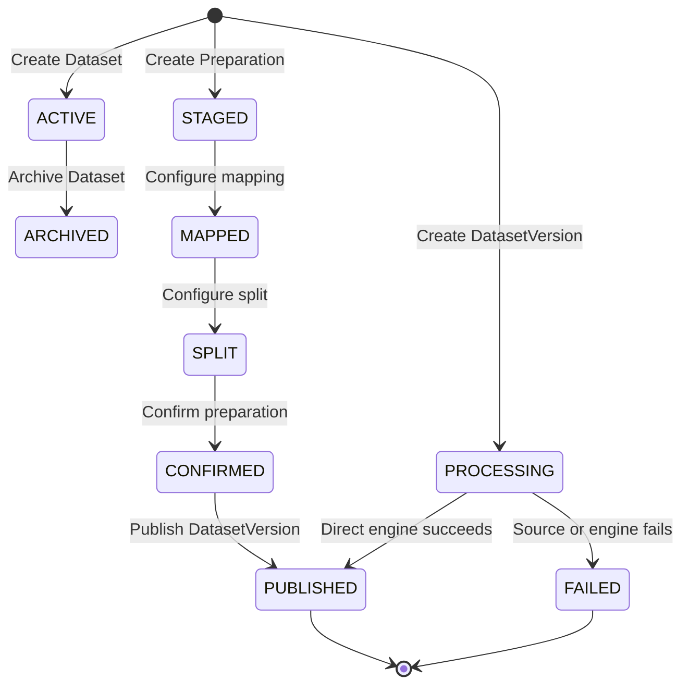
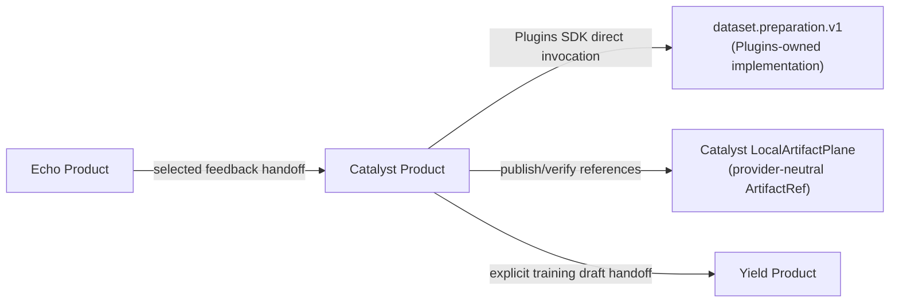

# Catalyst Product API & Architecture Specification

This document provides the authoritative product and API contract for **Catalyst**, classified as **`ACTIVE_PRODUCT`** (Product 1), the Cyrene Data Ingestion, Cleaning, Transformation, and Dataset Lifecycle Product.

---

## 1. Repository Role & Audience

- **Role**: `ACTIVE_PRODUCT` / Data Ingestion, Structuring & Dataset Lifecycle Service.
- **Audience**: ML Data Engineers, Dataset Curators, and Pipeline Operators.
- **Implementation Status**: `REFERENCE_MVP_READY` (implemented Product runtime).

---

## 2. What Catalyst Owns

Catalyst is the authoritative Product owner of:
- **Dataset Resources**: `Dataset`, `DatasetVersion`, and interactive `Preparation` state.
- **Preparation Intent & Review**: user-confirmed mapping, normalization, deduplication, split, and review configuration; algorithms are Plugins-owned.
- **Dataset Versioning & Lineage**: source provenance, transformation configuration, export references, and digest-linked lineage edges.
- **Product Handoffs**: explicit requests to Yield for training drafts and Echo for selected feedback imports.

### What Must NOT Be Implemented in Catalyst
- **Model Training Loops & Checkpointing**: Owned exclusively by **Yield**.
- **Model Inference & Serving**: Owned exclusively by **Reactor**.
- **Generic Process Supervision**: Owned by the **Platform Kernel** and never embedded in Catalyst.
- **Direct Hardware Probing**: Owned by the **Platform Node Agent** and never inferred by Catalyst.

---

## 3. Public Product Objects & Schemas

| Object Name | Type | Implementation Status | Description |
|---|---|---|---|
| `Dataset` | Entity | `REFERENCE_MVP_READY` | Product-owned collection of DatasetVersions. |
| `DatasetVersion` | Entity | `REFERENCE_MVP_READY` | Immutable processed snapshot referenced by exact `ArtifactRef` digests. |
| `Preparation` | Workflow | `REFERENCE_MVP_READY` | Product-owned import, mapping, normalization, deduplication, split, and review state. |
| `DataPreparationPort` | Application port | `LOCAL_ENDPOINT_VERIFIED` | Direct `dataset.preparation.v1` boundary; no in-tree processing implementation. |
| `ArtifactRef` | Shared contract | `WIRED` | Provider-neutral immutable content identity with an opaque producer-owned kind. |

---

## 4. Dataset Lifecycle & State Machine

---

## 5. Engine, Artifact, and Product Handoff Boundaries

The implementation invokes a resolved `dataset.preparation.v1` endpoint and
`LocalArtifactPlane` directly. Platform may resolve/install the package and
return an opaque `connection_ref`, but never carries the processing payload.
Product payloads go directly to the owning Product or Plugin: Catalyst sends
training-draft references to Yield and accepts explicitly selected feedback
references from Echo. Catalyst has no Platform source or package dependency;
the replaceable local adapter publishes and verifies bytes while the wire
protocol carries only the provider-neutral `ArtifactRef`. Artifact kind values
remain opaque producer-owned strings, so a new Product kind does not require a
Platform release.

---

## 6. Implementation Status Matrix

| Subsystem / Interface | Implementation Status | Notes |
|---|---|---|
| Dataset and DatasetVersion | `REFERENCE_MVP_READY` | Product state and lineage are persisted by Catalyst. |
| Dataset preparation Plugin adapter | `LOCAL_ENDPOINT_VERIFIED` | Direct `dataset.preparation.v1` invocation with output size/digest verification and explicit failure persistence. |
| Artifact provider adapter | `WIRED` | Catalyst's replaceable local CAS adapter publishes and verifies provider-neutral `ArtifactRef` values. |
| Yield handoff | `WIRED_NOT_RUN` | Requires a reachable Yield URL and target Product confirmation. |
| Echo feedback import | `WIRED_NOT_RUN` | Requires an explicitly selected Echo Artifact and resource reference. |
