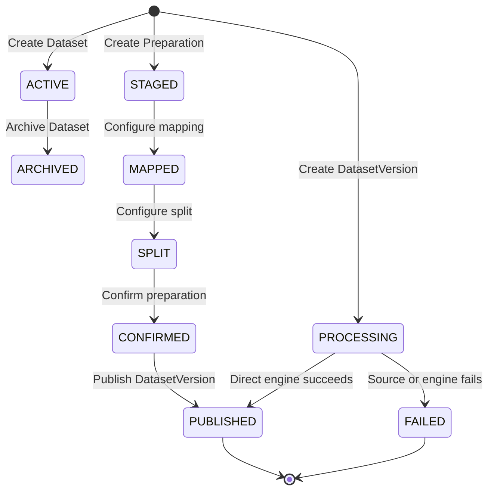
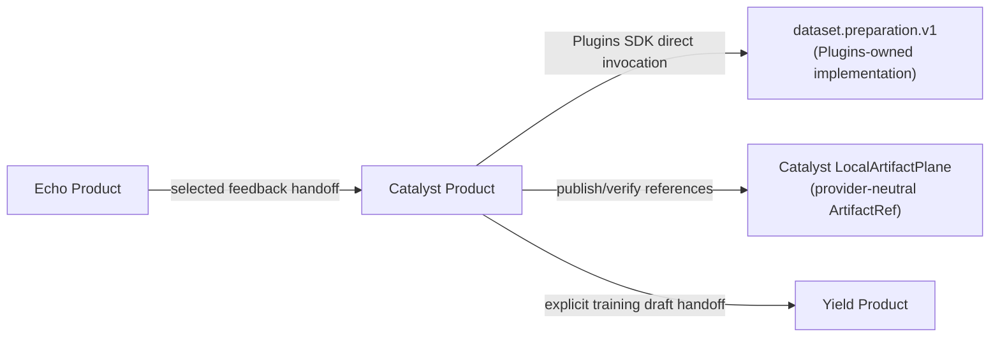
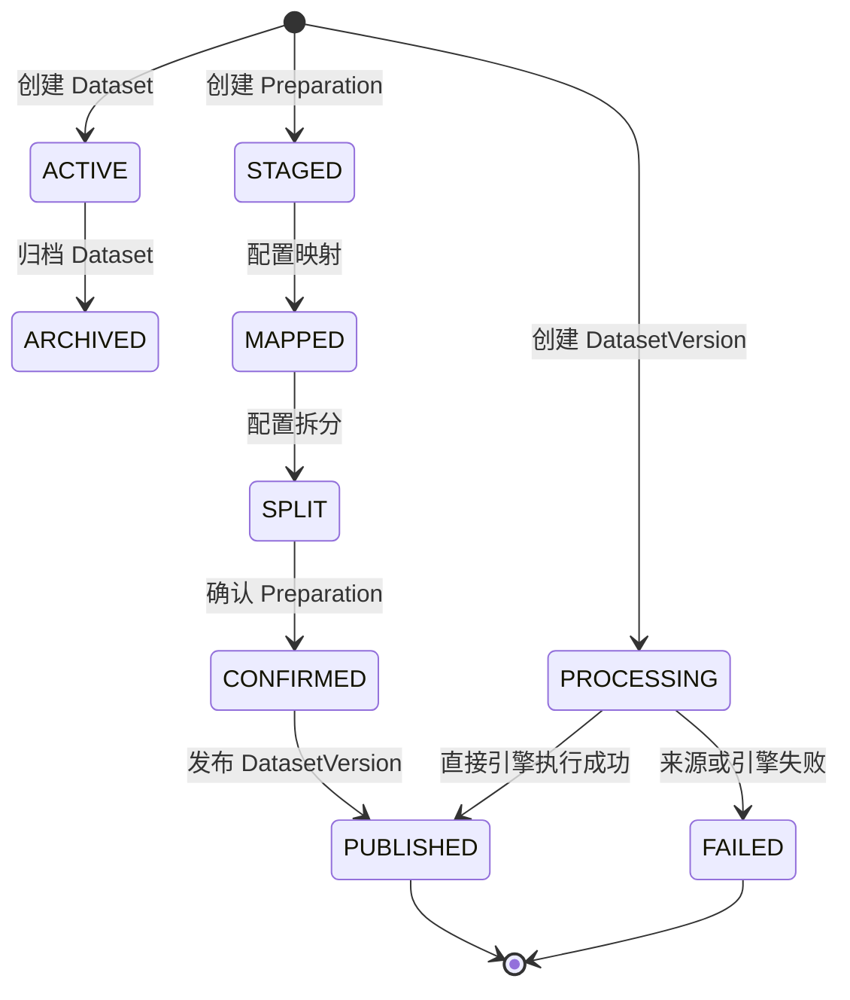

# Catalyst Product API & Architecture Specification

This document provides the authoritative product and API contract for **Catalyst**, classified as **`ACTIVE_PRODUCT`** (Product 1), the Cyrene Data Ingestion, Cleaning, Transformation, and Dataset Lifecycle Product.

---

## 1. Repository Role & Audience

- **Role**: `ACTIVE_PRODUCT` / Data Ingestion, Structuring & Dataset Lifecycle Service.
- **Audience**: ML Data Engineers, Dataset Curators, and Pipeline Operators.
- **Implementation Status**: `REFERENCE_MVP_READY` (implemented Product runtime).

---

## 2. What Catalyst Owns

Catalyst is the authoritative Product owner of:
- **Dataset Resources**: `Dataset`, `DatasetVersion`, and interactive `Preparation` state.
- **Preparation Intent & Review**: user-confirmed mapping, normalization, deduplication, split, and review configuration; algorithms are Plugins-owned.
- **Dataset Versioning & Lineage**: source provenance, transformation configuration, export references, and digest-linked lineage edges.
- **Product Handoffs**: explicit requests to Yield for training drafts and Echo for selected feedback imports.

### What Must NOT Be Implemented in Catalyst
- **Model Training Loops & Checkpointing**: Owned exclusively by **Yield**.
- **Model Inference & Serving**: Owned exclusively by **Reactor**.
- **Generic Process Supervision**: Owned by the **Platform Kernel** and never embedded in Catalyst.
- **Direct Hardware Probing**: Owned by the **Platform Node Agent** and never inferred by Catalyst.

---

## 3. Public Product Objects & Schemas

| Object Name | Type | Implementation Status | Description |
|---|---|---|---|
| `Dataset` | Entity | `REFERENCE_MVP_READY` | Product-owned collection of DatasetVersions. |
| `DatasetVersion` | Entity | `REFERENCE_MVP_READY` | Immutable processed snapshot referenced by exact `ArtifactRef` digests. |
| `Preparation` | Workflow | `REFERENCE_MVP_READY` | Product-owned import, mapping, normalization, deduplication, split, and review state. |
| `DataPreparationPort` | Application port | `LOCAL_ENDPOINT_VERIFIED` | Direct `dataset.preparation.v1` boundary with a CSV/Parquet serialization bridge; processing algorithms remain Plugin-owned. |
| `ArtifactRef` | Shared contract | `WIRED` | Provider-neutral immutable content identity with an opaque producer-owned kind. |

---

## 4. Dataset Lifecycle & State Machine

---

## 5. Engine, Artifact, and Product Handoff Boundaries

The implementation invokes a resolved `dataset.preparation.v1` endpoint and
`LocalArtifactPlane` directly. Platform may resolve/install the package and
return an opaque `connection_ref`, but never carries the processing payload.
Product payloads go directly to the owning Product or Plugin: Catalyst sends
training-draft references to Yield and accepts explicitly selected feedback
references from Echo. Catalyst has no Platform source or package dependency;
the replaceable local adapter publishes and verifies bytes while the wire
protocol carries only the provider-neutral `ArtifactRef`. Artifact kind values
remain opaque producer-owned strings, so a new Product kind does not require a
Platform release.

---

## 6. Implementation Status Matrix

| Subsystem / Interface | Implementation Status | Notes |
|---|---|---|
| Dataset and DatasetVersion | `REFERENCE_MVP_READY` | Product state and lineage are persisted by Catalyst. |
| Dataset preparation Plugin adapter | `LOCAL_ENDPOINT_VERIFIED` | Direct `dataset.preparation.v1` invocation, CSV/Parquet wire-format bridge, output size/digest verification, and explicit failure persistence. |
| Artifact provider adapter | `WIRED` | Catalyst's replaceable local CAS adapter publishes and verifies provider-neutral `ArtifactRef` values. |
| Yield handoff | `WIRED_NOT_RUN` | Requires a reachable Yield URL and target Product confirmation. |
| Echo feedback import | `WIRED_NOT_RUN` | Requires an explicitly selected Echo Artifact and resource reference. |
---
<!-- Chinese Translation / 中文翻译 -->

# Catalyst Product API 与架构规范

本文给出 Catalyst 的规范 Product/API 契约。Catalyst 分类为 `ACTIVE_PRODUCT`（Product 1），即 Cyrene 数据摄取、清理、转换与 Dataset 生命周期 Product。

## 1. 仓库职责与读者

- **职责**：`ACTIVE_PRODUCT`，提供数据摄取、结构化与 Dataset 生命周期服务。
- **读者**：机器学习数据工程师、Dataset 策展人员和流水线操作员。
- **实现状态**：`REFERENCE_MVP_READY`，Product 运行时已实现。

## 2. Catalyst 的所有权

Catalyst 是以下内容的规范 Product 所有者：

- **Dataset 资源**：`Dataset`、`DatasetVersion` 和交互式 `Preparation` 状态。
- **准备意图与审核**：由用户确认的映射、规范化、去重、拆分和审核配置；具体算法由 Plugins 拥有。
- **Dataset 版本与沿袭**：来源出处、转换配置、导出引用和由摘要关联的沿袭边。
- **Product 交接**：显式请求 Yield 创建训练草稿，以及请求 Echo 导入已选反馈。

### Catalyst 不得实现的内容

- **模型训练循环与检查点管理**：完全由 **Yield** 拥有。
- **模型推理与服务**：完全由 **Reactor** 拥有。
- **通用进程监管**：由 **Platform Kernel** 拥有，不得嵌入 Catalyst。
- **直接硬件探测**：由 **Platform Node Agent** 拥有，不得由 Catalyst 推断。

## 3. 公开 Product 对象与模式

| 对象 | 类型 | 实现状态 | 说明 |
| --- | --- | --- | --- |
| `Dataset` | 实体 | `REFERENCE_MVP_READY` | 由 Product 拥有的 DatasetVersion 集合。 |
| `DatasetVersion` | 实体 | `REFERENCE_MVP_READY` | 由精确 `ArtifactRef` 摘要引用的不可变处理快照。 |
| `Preparation` | 工作流 | `REFERENCE_MVP_READY` | Product 所有的导入、映射、规范化、去重、拆分和审核状态。 |
| `DataPreparationPort` | 应用端口 | `LOCAL_ENDPOINT_VERIFIED` | 直连 `dataset.preparation.v1` 边界，包含 CSV/Parquet 序列化桥接；处理算法仍由 Plugin 拥有。 |
| `ArtifactRef` | 共享契约 | `WIRED` | Provider 无关的不可变内容身份，带有不透明且由生产方拥有的类型。 |

## 4. Dataset 生命周期与状态机

## 5. 引擎、Artifact 与 Product 交接边界

Catalyst 通过 Plugins SDK 直接调用已解析的 `dataset.preparation.v1` 端点和 `LocalArtifactPlane`。Platform 可以解析/安装包并返回不透明的 `connection_ref`，但绝不承载处理负载。Product 负载直接发送给对应 Product 或 Plugin：Catalyst 将训练草稿引用交给 Yield，并接收 Echo 显式选中的反馈引用。Catalyst 不依赖 Platform 源码或包；可替换的本地适配器负责发布和验证字节，线协议只携带 Provider 无关的 `ArtifactRef`。Artifact 类型值是不透明、由生产方拥有的字符串，因此新增 Product 类型不要求发布 Platform 新版本。

## 6. 实现状态矩阵

| 子系统/接口 | 实现状态 | 说明 |
| --- | --- | --- |
| Dataset 与 DatasetVersion | `REFERENCE_MVP_READY` | Catalyst 持久化 Product 状态和沿袭。 |
| Dataset preparation Plugin 适配器 | `LOCAL_ENDPOINT_VERIFIED` | 直连调用 `dataset.preparation.v1`，提供 CSV/Parquet 线格式桥接、输出大小/摘要校验和显式失败持久化。 |
| Artifact provider 适配器 | `WIRED` | Catalyst 可替换的本地 CAS 适配器发布并验证 Provider 无关的 `ArtifactRef` 值。 |
| Yield 交接 | `WIRED_NOT_RUN` | 需要可访问的 Yield URL 和目标 Product 确认。 |
| Echo 反馈导入 | `WIRED_NOT_RUN` | 需要显式选中的 Echo Artifact 和资源引用。 |
