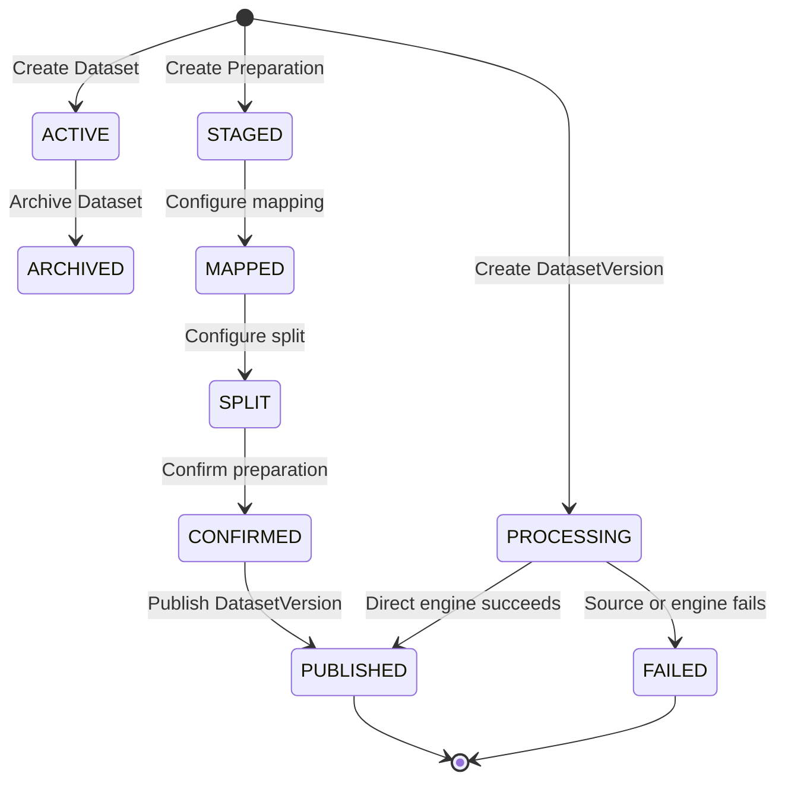
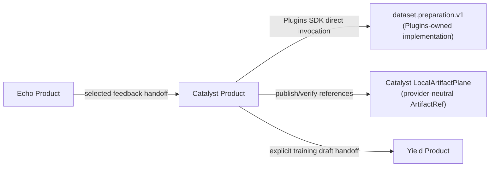
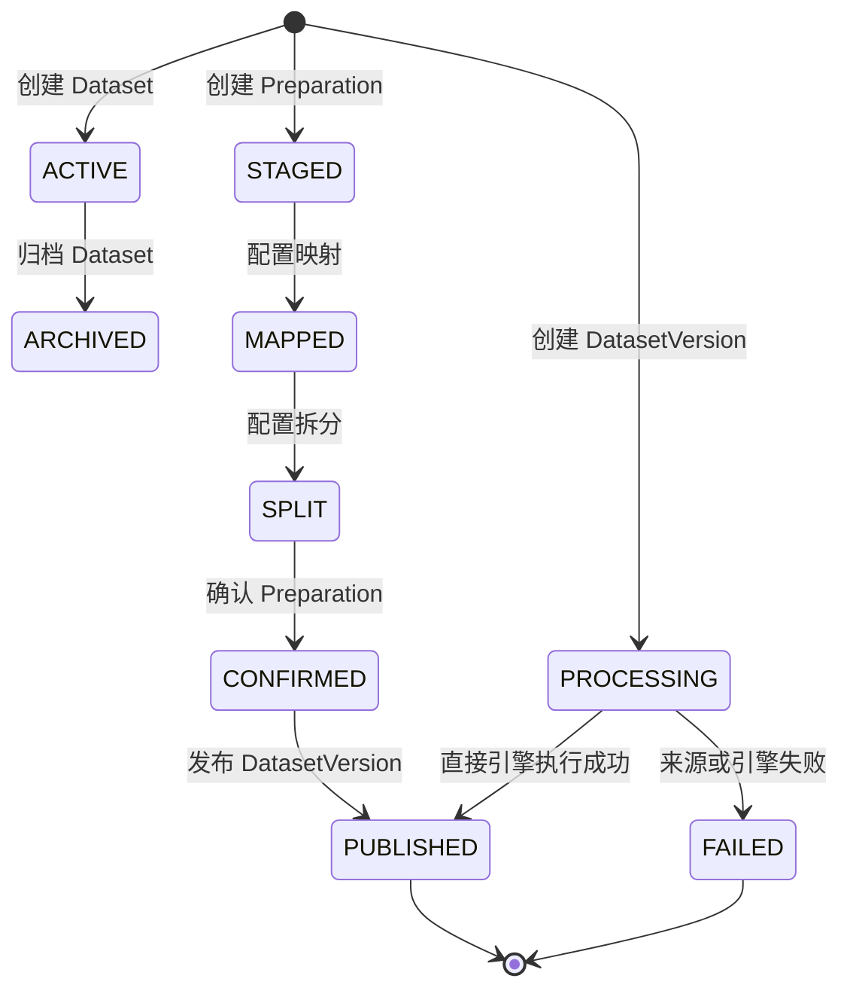

# Catalyst Product API & Architecture Specification

This document provides the authoritative product and API contract for **Catalyst**, classified as **`ACTIVE_PRODUCT`** (Product 1), the Cyrene Data Ingestion, Cleaning, Transformation, and Dataset Lifecycle Product.

---

## 1. Repository Role & Audience

- **Role**: `ACTIVE_PRODUCT` / Data Ingestion, Structuring & Dataset Lifecycle Service.
- **Audience**: ML Data Engineers, Dataset Curators, and Pipeline Operators.
- **Implementation Status**: `REFERENCE_MVP_READY` (implemented Product runtime).

---

## 2. What Catalyst Owns

Catalyst is the authoritative Product owner of:
- **Dataset Resources**: `Dataset`, `DatasetVersion`, and interactive `Preparation` state.
- **Preparation Intent & Review**: user-confirmed mapping, normalization, deduplication, split, and review configuration; algorithms are Plugins-owned.
- **Dataset Versioning & Lineage**: source provenance, transformation configuration, export references, and digest-linked lineage edges.
- **Product Handoffs**: explicit requests to Yield for training drafts and Echo for selected feedback imports.

### What Must NOT Be Implemented in Catalyst
- **Model Training Loops & Checkpointing**: Owned exclusively by **Yield**.
- **Model Inference & Serving**: Owned exclusively by **Reactor**.
- **Generic Process Supervision**: Owned by the **Platform Kernel** and never embedded in Catalyst.
- **Direct Hardware Probing**: Owned by the **Platform Node Agent** and never inferred by Catalyst.

---

## 3. Public Product Objects & Schemas

| Object Name | Type | Implementation Status | Description |
|---|---|---|---|
| `Dataset` | Entity | `REFERENCE_MVP_READY` | Product-owned collection of DatasetVersions. |
| `DatasetVersion` | Entity | `REFERENCE_MVP_READY` | Immutable processed snapshot referenced by exact `ArtifactRef` digests. |
| `Preparation` | Workflow | `REFERENCE_MVP_READY` | Product-owned import, mapping, normalization, deduplication, split, and review state. |
| `DataPreparationPort` | Application port | `LOCAL_ENDPOINT_VERIFIED` | Direct `dataset.preparation.v1` boundary with a CSV/Parquet serialization bridge; processing algorithms remain Plugin-owned. |
| `ArtifactRef` | Shared contract | `WIRED` | Provider-neutral immutable content identity with an opaque producer-owned kind. |

---

## 4. Dataset Lifecycle & State Machine

```mermaid
stateDiagram-v2
    [*] --> ACTIVE: Create Dataset
    ACTIVE --> ARCHIVED: Archive Dataset
    [*] --> STAGED: Create Preparation
    STAGED --> MAPPED: Configure mapping
    MAPPED --> SPLIT: Configure split
    SPLIT --> CONFIRMED: Confirm preparation
    CONFIRMED --> PUBLISHED: Publish DatasetVersion
    [*] --> PROCESSING: Create DatasetVersion
    PROCESSING --> PUBLISHED: Direct engine succeeds
    PROCESSING --> FAILED: Source or engine fails
    PUBLISHED --> [*]
    FAILED --> [*]
```

---

## 5. Engine, Artifact, and Product Handoff Boundaries

```mermaid
flowchart LR
    Catalyst["Catalyst Product"]
    Engine["dataset.preparation.v1<br/>(Plugins-owned implementation)"]
    Artifacts["Catalyst LocalArtifactPlane<br/>(provider-neutral ArtifactRef)"]
    Yield["Yield Product"]
    Echo["Echo Product"]

    Catalyst -->|Plugins SDK direct invocation| Engine
    Catalyst -->|publish/verify references| Artifacts
    Catalyst -->|explicit training draft handoff| Yield
    Echo -->|selected feedback handoff| Catalyst
```

The implementation invokes a resolved `dataset.preparation.v1` endpoint and
`LocalArtifactPlane` directly. Platform may resolve/install the package and
return an opaque `connection_ref`, but never carries the processing payload.
Product payloads go directly to the owning Product or Plugin: Catalyst sends
training-draft references to Yield and accepts explicitly selected feedback
references from Echo. Catalyst has no Platform source or package dependency;
the replaceable local adapter publishes and verifies bytes while the wire
protocol carries only the provider-neutral `ArtifactRef`. Artifact kind values
remain opaque producer-owned strings, so a new Product kind does not require a
Platform release.

---

## 6. Implementation Status Matrix

| Subsystem / Interface | Implementation Status | Notes |
|---|---|---|
| Dataset and DatasetVersion | `REFERENCE_MVP_READY` | Product state and lineage are persisted by Catalyst. |
| Dataset preparation Plugin adapter | `LOCAL_ENDPOINT_VERIFIED` | Direct `dataset.preparation.v1` invocation, CSV/Parquet wire-format bridge, output size/digest verification, and explicit failure persistence. |
| Artifact provider adapter | `WIRED` | Catalyst's replaceable local CAS adapter publishes and verifies provider-neutral `ArtifactRef` values. |
| Yield handoff | `WIRED_NOT_RUN` | Requires a reachable Yield URL and target Product confirmation. |
| Echo feedback import | `WIRED_NOT_RUN` | Requires an explicitly selected Echo Artifact and resource reference. |

## Private Workspace service API

The hidden-from-public-OpenAPI routes `/internal/workspace/v1/datasets`
support service-side list and create operations. The server resolves the
organization and Workspace from `CYRENE_WORKSPACE_SERVICE_AUTH_JSON`, a
deployment-injected JSON map containing SHA-256 token digests and fixed scope
identifiers. Callers send the corresponding high-entropy bearer token; request
bodies and actor headers cannot select a scope. Invalid configuration prevents
server startup, while missing configuration leaves private routes unavailable
with HTTP 503.

New private Datasets are visible only to the matching private token. Existing
rows stay unscoped, and legacy `/api/v1` reads continue to expose only
unscoped records. DatasetVersion, Preparation, preview, and export reads
resolve their parent Dataset before returning data, so a private Dataset's
descendants do not become available through legacy IDs. The private contract
is kept separately at
[`workspace-internal.openapi.yaml`](../contracts/product/v1/workspace-internal.openapi.yaml).
The caller's deployed secret binding and scope map still require deployment
and caller-audit evidence.

## Data Tools review and publication API

The Data Tools routes add raw source revisions, reviewed block snapshots,
durable processing runs, and knowledge/SFT package downloads while keeping
`Dataset` and `DatasetVersion` as the existing Product authorities. Upload
source bytes with `POST /api/v1/datasets/{datasetId}/sources?filename=...`.
PDF and DOCX parse runs use `document.parsing.v1`. JSONL training records use
Catalyst's bounded structured adapter: each row must contain `instruction` plus
`output` (optional `input`) or a `conversations` array. Only these learned
fields enter block text; `sourceFamily`, `conversationId`, `sampleId`, and
`_acl` stay in block metadata or policy, and the original uploaded Artifact
remains available.

Create `parse`, `buildKnowledge`, `prepareSft`, or `generateQa` work through
`POST /api/v1/datasets/{datasetId}/processing-runs`. The dataset-level GET route
lists durable run status after reload. Parse creates a draft `ContentRevision`;
edit a block with its expected revision ID, then approve the new revision using
`POST /api/v1/content-revisions/{revisionId}/review`. Output permissions fail
closed: each block must explicitly allow a profile, principal references, and
the `knowledge_retrieval` or `model_training` purpose before it can appear in
that output.

Knowledge and SFT runs operate on the same approved revision. Publish their
successful run IDs through `POST
/api/v1/datasets/{datasetId}/data-tools/versions`; the returned canonical
`DatasetVersion` includes additive `dataTools` package references. Download
each package independently with `GET
/api/v1/dataset-versions/{versionId}/data-tools/export?profile=knowledge` or
`profile=sft`. The legacy `DatasetVersion.output` remains the train JSONL
artifact for existing SFT/Yield consumers. A later approved revision makes
older derived runs and published profiles report `stale: true`.

The local service resolves direct Plugin bindings from
`CYRENE_DOCUMENT_PARSING_CONNECTION_REF`,
`CYRENE_KNOWLEDGE_PREPARATION_CONNECTION_REF`, and
`CYRENE_DATASET_GENERATION_CONNECTION_REF`. The Data Tools trial token is
`CYRENE_DATA_TOOLS_TOKEN`; its fixed identity may be configured with
`CYRENE_DATA_TOOLS_ORGANIZATION_ID` and `CYRENE_DATA_TOOLS_WORKSPACE_ID`
(defaults `data-tools-trial` and `data-tools`). When configured, every route
except `/healthz` requires the Bearer token and Dataset child resources enforce
the resolved Workspace scope. Keep the token in the server-side Client proxy.
---
<!-- Chinese Translation / 中文翻译 -->

# Catalyst Product API 与架构规范

本文给出 Catalyst 的规范 Product/API 契约。Catalyst 分类为 `ACTIVE_PRODUCT`（Product 1），即 Cyrene 数据摄取、清理、转换与 Dataset 生命周期 Product。

## 1. 仓库职责与读者

- **职责**：`ACTIVE_PRODUCT`，提供数据摄取、结构化与 Dataset 生命周期服务。
- **读者**：机器学习数据工程师、Dataset 策展人员和流水线操作员。
- **实现状态**：`REFERENCE_MVP_READY`，Product 运行时已实现。

## 2. Catalyst 的所有权

Catalyst 是以下内容的规范 Product 所有者：

- **Dataset 资源**：`Dataset`、`DatasetVersion` 和交互式 `Preparation` 状态。
- **准备意图与审核**：由用户确认的映射、规范化、去重、拆分和审核配置；具体算法由 Plugins 拥有。
- **Dataset 版本与沿袭**：来源出处、转换配置、导出引用和由摘要关联的沿袭边。
- **Product 交接**：显式请求 Yield 创建训练草稿，以及请求 Echo 导入已选反馈。

### Catalyst 不得实现的内容

- **模型训练循环与检查点管理**：完全由 **Yield** 拥有。
- **模型推理与服务**：完全由 **Reactor** 拥有。
- **通用进程监管**：由 **Platform Kernel** 拥有，不得嵌入 Catalyst。
- **直接硬件探测**：由 **Platform Node Agent** 拥有，不得由 Catalyst 推断。

## 3. 公开 Product 对象与模式

| 对象 | 类型 | 实现状态 | 说明 |
| --- | --- | --- | --- |
| `Dataset` | 实体 | `REFERENCE_MVP_READY` | 由 Product 拥有的 DatasetVersion 集合。 |
| `DatasetVersion` | 实体 | `REFERENCE_MVP_READY` | 由精确 `ArtifactRef` 摘要引用的不可变处理快照。 |
| `Preparation` | 工作流 | `REFERENCE_MVP_READY` | Product 所有的导入、映射、规范化、去重、拆分和审核状态。 |
| `DataPreparationPort` | 应用端口 | `LOCAL_ENDPOINT_VERIFIED` | 直连 `dataset.preparation.v1` 边界，包含 CSV/Parquet 序列化桥接；处理算法仍由 Plugin 拥有。 |
| `ArtifactRef` | 共享契约 | `WIRED` | Provider 无关的不可变内容身份，带有不透明且由生产方拥有的类型。 |

## 4. Dataset 生命周期与状态机

```mermaid
stateDiagram-v2
    [*] --> ACTIVE: 创建 Dataset
    ACTIVE --> ARCHIVED: 归档 Dataset
    [*] --> STAGED: 创建 Preparation
    STAGED --> MAPPED: 配置映射
    MAPPED --> SPLIT: 配置拆分
    SPLIT --> CONFIRMED: 确认 Preparation
    CONFIRMED --> PUBLISHED: 发布 DatasetVersion
    [*] --> PROCESSING: 创建 DatasetVersion
    PROCESSING --> PUBLISHED: 直接引擎执行成功
    PROCESSING --> FAILED: 来源或引擎失败
    PUBLISHED --> [*]
    FAILED --> [*]
```

## 5. 引擎、Artifact 与 Product 交接边界

Catalyst 通过 Plugins SDK 直接调用已解析的 `dataset.preparation.v1` 端点和 `LocalArtifactPlane`。Platform 可以解析/安装包并返回不透明的 `connection_ref`，但绝不承载处理负载。Product 负载直接发送给对应 Product 或 Plugin：Catalyst 将训练草稿引用交给 Yield，并接收 Echo 显式选中的反馈引用。Catalyst 不依赖 Platform 源码或包；可替换的本地适配器负责发布和验证字节，线协议只携带 Provider 无关的 `ArtifactRef`。Artifact 类型值是不透明、由生产方拥有的字符串，因此新增 Product 类型不要求发布 Platform 新版本。

## 6. 实现状态矩阵

| 子系统/接口 | 实现状态 | 说明 |
| --- | --- | --- |
| Dataset 与 DatasetVersion | `REFERENCE_MVP_READY` | Catalyst 持久化 Product 状态和沿袭。 |
| Dataset preparation Plugin 适配器 | `LOCAL_ENDPOINT_VERIFIED` | 直连调用 `dataset.preparation.v1`，提供 CSV/Parquet 线格式桥接、输出大小/摘要校验和显式失败持久化。 |
| Artifact provider 适配器 | `WIRED` | Catalyst 可替换的本地 CAS 适配器发布并验证 Provider 无关的 `ArtifactRef` 值。 |
| Yield 交接 | `WIRED_NOT_RUN` | 需要可访问的 Yield URL 和目标 Product 确认。 |
| Echo 反馈导入 | `WIRED_NOT_RUN` | 需要显式选中的 Echo Artifact 和资源引用。 |

## 私有 Workspace 服务 API

未公开到 public OpenAPI 的 `/internal/workspace/v1/datasets` 路由支持服务端
列举和创建。服务端从部署注入的 `CYRENE_WORKSPACE_SERVICE_AUTH_JSON` 读取
SHA-256 token 摘要及固定 scope 标识，并据此解析组织和 Workspace。调用方只发送
对应的高熵 Bearer token；请求正文和 actor header 不能选择 scope。配置无效会
阻止服务启动；缺少配置时私有路由返回 HTTP 503。

新私有 Dataset 仅对匹配的私有 token 可见。现有行继续保持无 scope 状态，
旧 `/api/v1` 读取仅返回无 scope 记录。DatasetVersion、Preparation、预览和导出
读取都会先解析父 Dataset，因此不能通过旧 ID 访问私有 Dataset 的后代资源。
私有契约单独保存在
[`workspace-internal.openapi.yaml`](../contracts/product/v1/workspace-internal.openapi.yaml)。
部署 secret 绑定和调用方 scope map 仍需部署及 caller-audit 证据。

## Data Tools 审核与发布 API

Data Tools 路由在保留既有 `Dataset` 和 `DatasetVersion` Product 权威的同时，增加
原始来源版本、可审核内容快照、持久化运行以及知识/SFT 包下载。使用
`POST /api/v1/datasets/{datasetId}/sources?filename=...` 上传来源字节。PDF 与 DOCX
parse 运行调用 `document.parsing.v1`。JSONL 训练记录由 Catalyst 的有界结构化适配器
处理：每行必须包含 `instruction` 和 `output`（可选 `input`），或 `conversations`
数组。只有这些学习字段进入 block 文本；`sourceFamily`、`conversationId`、`sampleId`
和 `_acl` 保留为 block 元数据或策略，原始上传 Artifact 仍保留。

通过 `POST /api/v1/datasets/{datasetId}/processing-runs` 创建 `parse`、
`buildKnowledge`、`prepareSft` 或 `generateQa` 运行。Dataset 级 GET 路由可在页面重载后
读取持久化状态。Parse 会创建草稿 `ContentRevision`；编辑 block 时须提交预期 revision
ID，再调用 `POST /api/v1/content-revisions/{revisionId}/review` 批准新修订。输出权限
默认拒绝：每个 block 都须显式允许相应 profile、principal 引用以及
`knowledge_retrieval` 或 `model_training` 用途，才能进入对应输出。

知识与 SFT 运行使用同一已批准修订。将成功运行 ID 提交到
`POST /api/v1/datasets/{datasetId}/data-tools/versions` 发布；响应是规范
`DatasetVersion`，并附带 `dataTools` 包引用。可分别调用
`GET /api/v1/dataset-versions/{versionId}/data-tools/export?profile=knowledge` 或
`profile=sft` 下载完整包。旧 `DatasetVersion.output` 仍是 train JSONL Artifact，兼容
既有 SFT/Yield 消费方。之后产生并批准的新修订会使旧派生运行和 profile 显示
`stale: true`。

本地服务从 `CYRENE_DOCUMENT_PARSING_CONNECTION_REF`、
`CYRENE_KNOWLEDGE_PREPARATION_CONNECTION_REF` 和
`CYRENE_DATASET_GENERATION_CONNECTION_REF` 解析直连 Plugin binding。Data Tools 试用
token 为 `CYRENE_DATA_TOOLS_TOKEN`；固定身份可由
`CYRENE_DATA_TOOLS_ORGANIZATION_ID` 与 `CYRENE_DATA_TOOLS_WORKSPACE_ID` 配置，默认值为
`data-tools-trial` 和 `data-tools`。配置后，除 `/healthz` 外所有路由均要求 Bearer
token，并对 Dataset 子资源执行 Workspace 范围校验。token 应由服务端 Client 代理持有。
