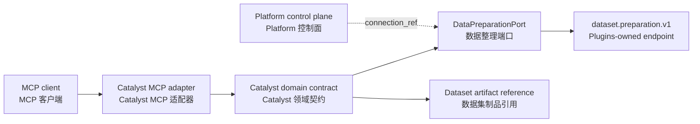

# MCP integration / MCP 集成

## Current posture / 当前状态

This repository does not contain an MCP server or client. Its active surface is the Product HTTP API and direct dataset-preparation Plugin adapter.

当前仓库不包含 MCP 服务端或客户端；活跃范围是 Product HTTP API 与数据整理插件直连适配器。

The document records the intended boundary so a future adapter can be reviewed without conflating protocol transport with Catalyst domain ownership.

本文档记录预期边界，便于未来适配器评审，同时避免把协议传输层与 Catalyst 领域归属混为一谈。

## Intended adapter boundary / 预期适配边界

The adapter should translate validated protocol requests into domain operations and translate domain results into protocol responses. It should not expose arbitrary filesystem, process, or hardware operations.

适配器应将经过校验的协议请求转换为领域操作，再将领域结果转换为协议响应；不应暴露任意文件系统、进程或硬件操作。

## Review checklist / 评审清单

- Keep transport parsing separate from dataset lifecycle transitions.
- Validate capability name and version before dispatch.
- Return stable domain errors instead of leaking provider internals.
- Preserve artifact digests and lineage references in responses where the contract requires them.
- Treat authentication, authorization, rate limits, and request-size limits as the hosting boundary's responsibility unless the API contract says otherwise.

- 将传输解析与数据集生命周期状态转换分离。
- 分发前校验能力名称与版本。
- 返回稳定的领域错误，不泄漏提供方内部细节。
- 契约要求时，在响应中保留制品摘要与血缘引用。
- 除非 API 契约另有规定，认证、授权、限流与请求大小限制由宿主边界负责。
