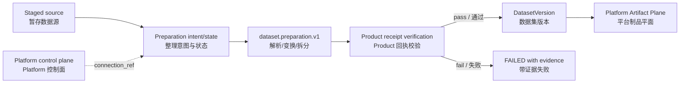

# Catalyst architecture overview / Catalyst 架构概览

## Role and boundary / 角色与边界

Catalyst owns dataset domain objects, user-confirmed preparation intent, workflow state, lineage, publication decisions, and Product quality policy. Reusable parsing and transformation algorithms are Plugins-owned.

Catalyst 负责数据集领域对象、用户确认的整理意图、工作流状态、血缘、发布决策与 Product 质量策略；可复用解析和变换算法由 Plugins 实现。

The runnable Product calls `dataset.preparation.v1` through a fail-closed direct
Plugin adapter. The former local processing implementation and obsolete
`data.processor.v1` name are removed.

当前可运行 Product 通过故障关闭的插件直连适配器调用 `dataset.preparation.v1`；旧本地处理实现与过时的 `data.processor.v1` 名称已删除。

## End-to-end flow / 端到端流程

The flow is implemented locally and covered by a real direct endpoint test. It
does not by itself prove hosted CI, canonical merge/read-back, or production storage.

该流程已在本地实现并由真实直连端点测试覆盖；它本身不证明 Hosted CI、规范分支合并/回读或生产存储。

## Lifecycle states / 生命周期状态

| State | Meaning / 含义 | Exit condition / 退出条件 |
|---|---|---|
| `DRAFT` | Dataset metadata exists; sources may be registered / 数据集元数据已创建，可登记数据源 | Ingestion is triggered / 触发摄取 |
| `PARSING` | Sources are being decoded into records / 正在将数据源解析为记录 | Parse succeeds or fails / 解析成功或失败 |
| `CLEANING` | Rules and transformations are applied / 正在应用清洗规则与变换 | Transform succeeds or fails / 变换成功或失败 |
| `DEDUPLICATING` | Duplicate samples are evaluated / 正在评估重复样本 | Deduplication completes / 去重完成 |
| `VALIDATING` | Quality and policy gates are checked / 正在检查质量与策略门槛 | Publish or reject / 发布或拒绝 |
| `PUBLISHED` | An immutable version is available / 不可变版本可用 | Archive / 归档 |
| `FAILED` / `REJECTED` | Processing or quality gate did not pass / 处理或质量门槛未通过 | Operator review or retry / 操作员复核或重试 |

## Ownership boundaries / 归属边界

- Catalyst owns preparation intent/review, Product quality policy, dataset lineage, and dataset-version metadata.
- Plugins own concrete parsing, normalization, deduplication, grouping, transformation, and split algorithms.
- Yield owns model training loops and checkpointing.
- Reactor owns model inference and serving.
- Platform Kernel owns generic process supervision and execution substrate.
- Platform Node Agent owns direct hardware probing.

- Catalyst 负责整理意图/复核、Product 质量策略、数据集血缘与数据集版本元数据。
- Plugins 负责具体解析、标准化、去重、分组、变换与拆分算法。
- Yield 负责模型训练循环与检查点。
- Reactor 负责模型推理与服务化。
- Platform Kernel 负责通用进程监管与执行底座。
- Platform Node Agent 负责直接硬件探测。
---
<!-- Chinese Translation / 中文翻译 -->

## 权威表中文对照

| 关注点 | 规范所有者 |
| --- | --- |
| Dataset 与 DatasetVersion 状态和沿袭 | Catalyst Product |
| 数据准备能力的解析和执行模式选择 | Platform 与 Plugins 的规范边界 |
| JSON/CSV/Parquet 解析、规范化与转换 | Plugins 所有的 `dataset.preparation.v1` |
| Artifact 字节的发布与读取 | 可替换的 Artifact Plane 适配器 |
| 训练草稿交接 | Yield Product |
| 已选反馈导入 | Echo Product |
