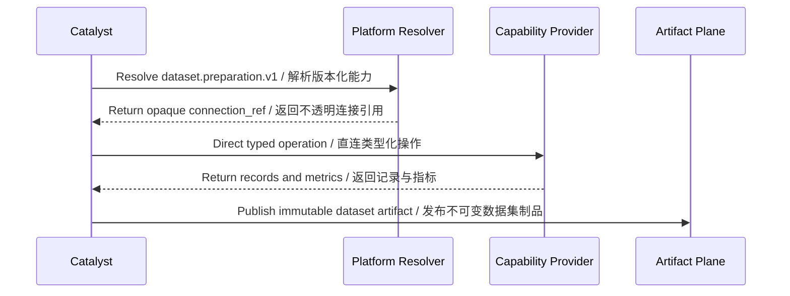

# Tool and capability system / 工具与能力系统

## Extension-point model / 扩展点模型

Catalyst consumes narrowly scoped providers through versioned capability seams. A provider supplies an operation; Catalyst retains ownership of dataset state, lineage, and publication decisions.

Catalyst 通过带版本的能力接缝消费边界清晰的提供方。提供方负责某项操作；Catalyst 仍保有数据集状态、血缘与发布决策的归属权。

| Capability seam | Responsibility / 职责 | Status in `service.json` / `service.json` 状态 |
|---|---|---|
| `dataset.preparation.v1` | Inspect, normalize, map, group, deduplicate, transform, and split staged datasets / 检查、标准化、映射、分组、去重、变换与拆分已暂存数据集 | Active direct Plugin dependency / 活跃插件直连依赖 |

The manifest is the source of truth for currently declared extension-point names. The table also reflects the product contract documented in `docs/API.md`; it does not add or change manifest entries.

清单文件是当前已声明扩展点名称的事实来源。上表同时反映 `docs/API.md` 中的产品契约，但不会新增或修改清单条目。

## Resolution and execution / 解析与执行

The Product adapter and Plugins-owned implementation are exercised through a real local direct endpoint. Platform is control plane only and does not proxy the payload.

Product 适配器与 Plugins 所有实现已通过真实本地直连端点验证；Platform 只承担控制面，不代理业务载荷。

## Non-ownership rules / 非归属规则

- A provider must not become the authority for dataset lifecycle state.
- Catalyst must not reimplement the reusable preparation algorithms behind the capability.
- Catalyst must not duplicate generic process supervision or hardware discovery.
- Training and inference behavior must remain in their owning products.
- Capability versions are part of compatibility decisions and should be recorded in lineage metadata.

- 提供方不能成为数据集生命周期状态的权威来源。
- Catalyst 不得重复实现该能力背后的可复用整理算法。
- Catalyst 不应复制通用进程监管或硬件发现能力。
- 训练与推理行为必须留在各自所属产品中。
- 能力版本属于兼容性决策的一部分，应记录到血缘元数据中。
